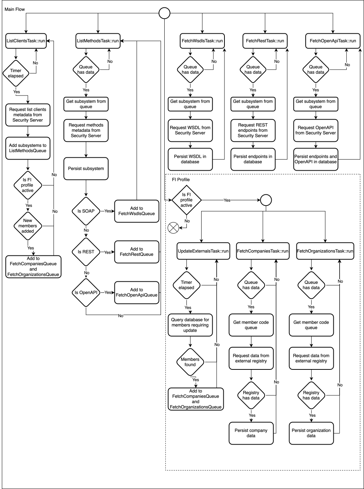

# Introduction to X-Road Catalog Collector

The purpose of this module is to collect members, subsystems and services from the X-Road ecosystem and store them to 
a database. 

The module is implemented using JAVA virtual threads: 

* `FetchWsdlTask` - fetches WSDL descriptions of SOAP services from the X-Road instance and stores them to the db.
* `FetchRestTask` - fetches REST services without descriptions from the X-Road instance and stores them to the db.
* `FetchOpenApiTask` - fetches OpenAPI descriptions of Rest services from the X-Road instance and stores them to the db.
* `ListClientsTask` - fetches a list of clients from the X-Road instance and stores them to the db.
* `ListMethodsTask` - fetches a list of services from the X-Road instance and stores them to the db.
* `FetchOrganizationsTask` - fetches a list of public organizations from an external API and stores them to the db.
* `FetchCompaniesTask` - fetches a list of private companies from an external API and stores them to the db.

The following diagram gives a high-level overview of how the tasks are executed:


See also the [Installation Guide](../doc/xroad_catalog_installation_guide.md) and
[User Guide](../doc/xroad_catalog_user_guide.md).

## Build

X-Road Catalog Collector can be built by running:

```bash
../gradlew clean build
```

## Configuration

X-Road Catalog Collector configurations are divided into three groups:

### Mandatory to provide

Values of following configurations are expected to be provided by service's user. Otherwise, service may fail to start.
Configurations are categorized according to their usage into different groups in the following sections.
> [!NOTE]
> Some configuration parameters are required depending on the use-case. For example, `spring.liquibase.parameters.users.*`
> parameters are only required if liquibase context include `users`.

#### Mandatory Data Source and Liquibase Configurations

| Data Source and Liquibase Configurations                                                                                                                                   | Required | Defaults                  | Comment                                                                                                                                                                                                                                                                                                                   | Since |
|----------------------------------------------------------------------------------------------------------------------------------------------------------------------------|----------|---------------------------|---------------------------------------------------------------------------------------------------------------------------------------------------------------------------------------------------------------------------------------------------------------------------------------------------------------------------|-------|
| [spring.datasource.url](https://docs.spring.io/spring-boot/appendix/application-properties/index.html#application-properties.data.spring.datasource.url)                   | Y        |                           |                                                                                                                                                                                                                                                                                                                           | 1.0.0 |
| [spring.datasource.username](https://docs.spring.io/spring-boot/appendix/application-properties/index.html#application-properties.data.spring.datasource.username)         | Y        |                           | If database users will be created by liquibase scripts (see `spring.liquibase.contexts`), username must match `spring.liquibase.parameters.users.collector.username`.                                                                                                                                                     | 1.0.0 |
| [spring.datasource.password](https://docs.spring.io/spring-boot/appendix/application-properties/index.html#application-properties.data.spring.elasticsearch.password)      | Y        |                           | If database users will be created by liquibase scripts (see `spring.liquibase.contexts`), username must match `spring.liquibase.parameters.users.collector.password`.                                                                                                                                                     | 1.0.0 |
| [spring.liquibase.user](https://docs.spring.io/spring-boot/appendix/application-properties/index.html#application-properties.data-migration.spring.liquibase.user)         | Y        | `xroad_catalog`           | An admin user or the database owner to be used by liquibase scripts to apply DDLs.                                                                                                                                                                                                                                        | 1.0.0 |
| [spring.liquibase.password](https://docs.spring.io/spring-boot/appendix/application-properties/index.html#application-properties.data-migration.spring.liquibase.password) | Y        |                           | Password of the admin user or the database owner to be used by liquibase scripts to apply DDLs.                                                                                                                                                                                                                           | 1.0.0 |
| [spring.liquibase.contexts](https://docs.spring.io/spring-boot/appendix/application-properties/index.html#application-properties.data-migration.spring.liquibase.contexts) | N        | `users`                   | Available values are `users` and `fi`. `users` is used to create new users (a user for collector module and a user for lister module). `fi` is used to apply DDLs that are Finland specific. Only include `fi` if `xroad-catalog.country.fi.enabled` is `true`. Multiple values can be comma separated, e.g., `users,fi`. | 1.0.0 |
| spring.liquibase.parameters.users.collector.username                                                                                                                       | N        | `xroad_catalog_collector` | Mandatory if liquibase context include `users`. The username will be used to create a new user with full read/write privilege to everything in the database.                                                                                                                                                              | 1.0.0 |
| spring.liquibase.parameters.users.collector.password                                                                                                                       | N        |                           | Mandatory if liquibase context include `users`. The password will be used to create a new user with full read/write privilege to everything in the database.                                                                                                                                                              | 1.0.0 |
| spring.liquibase.parameters.users.lister.username                                                                                                                          | N        | `xroad_catalog_lister`    | Mandatory if liquibase context include `users`. The username will be used to create a new user with read-only privilege to all tables, views, and functions in the database.                                                                                                                                              | 1.0.0 |
| spring.liquibase.parameters.users.lister.password                                                                                                                          | N        |                           | Mandatory if liquibase context include `users`. The password will be used to create a new user with read-only privilege to all tables, views, and functions in the database.                                                                                                                                              | 1.0.0 |

#### Mandatory configurations required by common features

| Configurations                            | Required | Defaults                                     | Description                                                                                                                                                                                           | Since |
|-------------------------------------------|----------|----------------------------------------------|-------------------------------------------------------------------------------------------------------------------------------------------------------------------------------------------------------|-------|
| `xroad-catalog.target.xroad-instance`     | Y        |                                              | A parameter for setting the X-Road instance.                                                                                                                                                          | 1.0.0 |
| `xroad-catalog.target.subsystem-code`     | Y        |                                              | A parameter for setting the X-Road sub-system code.                                                                                                                                                   | 1.0.0 |
| `xroad-catalog.target.member-class`       | Y        |                                              | A parameter for setting the X-Road member class.                                                                                                                                                      | 1.0.0 |
| `xroad-catalog.target.member-code`        | Y        |                                              | A parameter for setting the X-Road member code.                                                                                                                                                       | 1.0.0 |
| `xroad-catalog.urls.security-server-host` | Y        |                                              | A parameter for setting the security server host to connect to. e.g., http://security.server.host:8080                                                                                                | 1.0.0 |
| `xroad-catalog.urls.list-clients-host`    | Y        | `${xroad-catalog.urls.security-server-host}` | A parameter for setting the security server host to be used to get list of clients. Default value references `xroad-catalog.urls.security-server-host`.                                               | 1.0.0 |
| `xroad-catalog.urls.webservices-endpoint` | Y        | `${xroad-catalog.urls.security-server-host}` | A parameter for setting the security server host to be used to get list of OpenAPI services, SOAP services, and list of services. Default value references `xroad-catalog.urls.security-server-host`. | 1.0.0 |

#### Mandatory configurations required by Finland-specific features

| Configurations                                     | Required | Defaults | Description                                                                                                                                                                   | Since |
|----------------------------------------------------|----------|----------|-------------------------------------------------------------------------------------------------------------------------------------------------------------------------------|-------|
| `xroad-catalog.country.fi.enabled`                 | Y        | `false`  | A parameter to enable/disable Finland specific features. If `false`, then all Finland specific features are disabled and all related parameters becomes irrelevant (not used) | 1.0.0 |
| `xroad-catalog.country.fi.fetch.companies.url`     | N        |          | A parameter for setting the URL to be used to fetch companies' data. Mandatory if `xroad-catalog.country.fi.enabled` is `true`                                                | 1.0.0 |
| `xroad-catalog.country.fi.fetch.organizations.url` | N        |          | A parameter for setting the URL to be used to fetch organizations' data. Mandatory if `xroad-catalog.country.fi.enabled` is `true`                                            | 1.0.0 |

### Optional configurations

Values of following configurations are optional and customizable by service's user. If a value is not provided, default
values will be used.

#### Optional configurations required by common features

| Parameter                                              | Required | Defaults                            | Description                                                                                                                                                                                                                                                                                                  | Since |
|--------------------------------------------------------|----------|-------------------------------------|--------------------------------------------------------------------------------------------------------------------------------------------------------------------------------------------------------------------------------------------------------------------------------------------------------------|-------|
| `xroad-catalog.ssl-keystore.location`                  | N        | `/etc/xroad/xroad-catalog/keystore` | A parameter for setting the keystore's location that contains SSL certificates required to connect to X-Road host.                                                                                                                                                                                           | 1.0.0 |
| `xroad-catalog.ssl-keystore.password`                  | N        | `changeit`                          | A parameter for setting the keystore's password.                                                                                                                                                                                                                                                             | 1.0.0 |
| `xroad-catalog.pool-size.fetch-openapi`                | N        | `10`                                | A parameter for setting the amount of virtual threads in the pool for fetching OpenAPI services from Security Server, e.g. value `10` means `10 virtual threads`.                                                                                                                                            | 1.0.0 |
| `xroad-catalog.pool-size.fetch-rest`                   | N        | `10`                                | A parameter for setting the amount of virtual threads in the pool for fetching REST services from Security Server, e.g. value `10` means `10 virtual threads`.                                                                                                                                               | 1.0.0 |
| `xroad-catalog.pool-size.fetch-wsdl`                   | N        | `10`                                | A parameter for setting the amount of virtual threads in the pool for fetching WSDLs from Security Server, e.g. value `10` means `10 virtual threads`.                                                                                                                                                       | 1.0.0 |
| `xroad-catalog.pool-size.list-methods`                 | N        | `50`                                | A parameter for setting the amount of virtual threads in the pool for fetching methods metadata from Security Server, e.g. value `50` means `50 virtual threads`.                                                                                                                                            | 1.0.0 |
| `xroad-catalog.log-storage.error-log-length-in-days`   | N        | `90`                                | A parameter for setting the amount in days for how long the errors logs should be kept in the db, e.g. value `90` means `for 90 days`.                                                                                                                                                                       | 1.0.0 |
| `xroad-catalog.log-storage.flush-log-time-after-hour`  | N        | `3`                                 | A parameter for setting the start of time interval during which the error logs in the db will be deleted when those exceed the amount in days set by `xroad-catalog.log-storage.error-log-length-in-days` parameter, e.g. value `18` means starting from `18:00`.                                            | 1.0.0 |
| `xroad-catalog.log-storage.flush-log-time-before-hour` | N        | `4`                                 | A parameter for setting the end of time interval during which the error logs in the db will be deleted when those exceed the amount in days set by `xroad-catalog.log-storage.error-log-length-in-days` parameter, e.g. value  `23` means ending at `23:00`.                                                 | 1.0.0 |
| `xroad-catalog.tasks.collector-interval-min`           | N        | `20`                                | A parameter for setting the amount of time in minutes after which the X-Road Catalog Collector should start re-fetching data from Security Server, e.g. value `20` means `every 20 minutes`.                                                                                                                 | 1.0.0 |
| `xroad-catalog.tasks.fetch-run-unlimited`              | N        | `false`                             | A parameter for setting whether the X-Road Catalog Collector should try to fetch data from Security Server continuously during a day or only between certain hours, e.g. value `true` means `continously`.                                                                                                   | 1.0.0 |
| `xroad-catalog.tasks.fetch-time-after-hour`            | N        | `3`                                 | A parameter for setting the start of time interval during which the X-Road Catalog Collector should try to fetch data from Security Server continuously (this parameter will be ignored if the parameter `xroad-catalog.fetch-run-unlimited` is set to `true`), e.g. value `18` means starting from `18:00`. | 1.0.0 |
| `xroad-catalog.tasks.fetch-time-before-hour`           | N        | `4`                                 | A parameter for setting the end of time interval during which the X-Road Catalog Collector should try to fetch data from Security Server continuously (this parameter will be ignored if the parameter `xroad-catalog.fetch-run-unlimited` is set to `true`), e.g. value `23` means ending at `23:00`.       | 1.0.0 |

#### Optional configurations required by Finland-specific features

> [!NOTE]
> The following configurations will take effect only when `xroad-catalog.country.fi.enabled` is `true`

| Parameter                                                   | Required | Defaults | Description                                                                                                                                                                                                                                                                                                                      | Since |
|-------------------------------------------------------------|----------|----------|----------------------------------------------------------------------------------------------------------------------------------------------------------------------------------------------------------------------------------------------------------------------------------------------------------------------------------|-------|
| `xroad-catalog.country.fi.fetch.companies.pool-size`        | N        | `10`     | A parameter for setting the amount of virtual threads in the pool for fetching companies from the companies API, e.g. value `10` means `10 virtual threads`. This controls how many parallel requests will hit the companies API.                                                                                                | 1.0.0 |
| `xroad-catalog.country.fi.fetch.organizations.pool-size`    | N        | `10`     | A parameter for setting the amount of virtual threads in the pool for fetching organizations from the organizations API, e.g. value `10` means `10 virtual threads`. This controls how many parallel requests will hit the organizations API.                                                                                    | 1.0.0 |
| `xroad-catalog.country.fi.fetch.external-limit`             | N        | `500`    | A parameter for setting the maximum amount of Members that should be fetched per external API in one run, e.g. value `500` means `500 members`. In the current implementation the example value would fetch `500` members information from both the `company` and `organization` API.                                            | 1.0.0 |
| `xroad-catalog.country.fi.fetch.external-update-after-days` | N        | `7`      | A parameter for setting the amount of days after which the X-Road Catalog Collector should consider Company and Organization data stale and try to fetch data from the external API again, e.g. value `7` means `after 7 days`.                                                                                                  | 1.0.0 |
| `xroad-catalog.country.fi.fetch.external-interval-min`      | N        | `20`     | A parameter for setting the amount of time in minutes after which the X-Road Catalog Collector should start re-fetching data from the external API, e.g. value `20` means `every 20 minutes`. This works together with the following two parameters to determine how often data is checked for staleness and updated in a batch. | 1.0.0 |
| `xroad-catalog.country.fi.fetch.external-run-unlimited`     | N        | `false`  | A parameter for setting whether the X-Road Catalog Collector should try to fetch data from the external API continuously during a day or only between certain hours, e.g. value `true` means `continously`.                                                                                                                      | 1.0.0 |
| `xroad-catalog.country.fi.fetch.external-time-after-hour`   | N        | `3`      | A parameter for setting the start of time interval during which the X-Road Catalog Collector should try to fetch data from the companies API continuously.                                                                                                                                                                       | 1.0.0 |
| `xroad-catalog.country.fi.fetch.external-time-before-hour`  | N        | `4`      | A parameter for setting the end of time interval during which the X-Road Catalog Collector should try to fetch data from the companies API continuously.                                                                                                                                                                         | 1.0.0 |

### Fixed-Mandatory values to include in `application.yaml`

The following list of configurations must be included in the `application.yaml` file without modifications to their
values.
> [!IMPORTANT]
> If user is not using the `application.yaml` file to customize the configurations, e.g., using spring boot profile or k8s
> configmap, service will use the default `application.yaml` which provide these values already.

#### Fixed values for Data Source and Liquibase Configurations

| Data Source and Liquibase Configurations                                                                                                                                             | Required | Defaults                                         | Comment                                                                 | Since |
|--------------------------------------------------------------------------------------------------------------------------------------------------------------------------------------|----------|--------------------------------------------------|-------------------------------------------------------------------------|-------|
| [spring.datasource.driver-class-name](https://docs.spring.io/spring-boot/appendix/application-properties/index.html#application-properties.data.spring.datasource.driver-class-name) | Y        |                                                  |                                                                         | 1.0.0 |
| [spring.jpa.database](https://docs.spring.io/spring-boot/appendix/application-properties/index.html#application-properties.data.spring.jpa.database)                                 | N        | `POSTGRESQL`                                     |                                                                         | 1.0.0 |
| [spring.jpa.generate-ddl](https://docs.spring.io/spring-boot/appendix/application-properties/index.html#application-properties.data.spring.jpa.generate-ddl)                         | Y        | `false`                                          | Always use `false`. Liquibase will apply modified DDLs.                 | 1.0.0 |
| [spring.jpa.open-in-view](https://docs.spring.io/spring-boot/appendix/application-properties/index.html#application-properties.data.spring.jpa.open-in-view)                         | N        | `false`                                          | Preferably `false` in production.                                       | 1.0.0 |
| [spring.jpa.show-sql](https://docs.spring.io/spring-boot/appendix/application-properties/index.html#application-properties.data.spring.jpa.show-sql)                                 | N        | `false`                                          | Use to debug SQL statements executed. Preferably `false` in production. | 1.0.0 |
| [spring.jpa.hibernate.ddl-auto](https://docs.spring.io/spring-boot/appendix/application-properties/index.html#application-properties.data.spring.jpa.hibernate.ddl-auto)             | Y        | `none`                                           | Keep to `none` to avoid conflict with liquibase.                        | 1.0.0 |
| spring.jpa.properties.hibernate.dialect                                                                                                                                              | Y        | `org.hibernate.dialect.PostgreSQLDialect`        | PostgreSQL is the only supported RDMBS.                                 | 1.0.0 |
| [spring.liquibase.enabled](https://docs.spring.io/spring-boot/appendix/application-properties/index.html#application-properties.data-migration.spring.liquibase.enabled)             | Y        | `true`                                           | `true` to execute liquibase changesets against database during startup. | 1.0.0 |
| [spring.liquibase.change-log](https://docs.spring.io/spring-boot/appendix/application-properties/index.html#application-properties.data-migration.spring.liquibase.change-log)       | Y        | `classpath:db/changelog/db.changelog-master.xml` | Points to changesets maintained by collector module.                    | 1.0.0 |
| [spring.liquibase.show-summary](https://docs.spring.io/spring-boot/appendix/application-properties/index.html#application-properties.data-migration.spring.liquibase.show-summary)   | N        | `verbose`                                        | Prints a summary of liquibase files during application's startup        | 1.0.0 |

#### Fixed values for Spring Boot framework configurations

| Spring Boot framework configurations                                                                                                                                                                   | Required | Defaults | Comment                                         | Since |
|--------------------------------------------------------------------------------------------------------------------------------------------------------------------------------------------------------|----------|----------|-------------------------------------------------|-------|
| [spring.main.allow-bean-definition-overriding](https://docs.spring.io/spring-boot/appendix/application-properties/index.html#application-properties.core.spring.main.allow-bean-definition-overriding) | Y        | `true`   |                                                 | 1.0.0 |
| [spring.main.web-application-type](https://docs.spring.io/spring-boot/appendix/application-properties/index.html#application-properties.core.spring.main.web-application-type)                         | Y        | `none`   | Collector module does not require a web server. | 1.0.0 |

## Run

X-Road Catalog Collector can be run by using Gradle:

```bash
../gradlew bootRun
```

or by running it from a JAR file:

```bash
java -jar target/xroad-catalog-collector-1.0-SNAPSHOT.jar
```

## Run against a remote Security Server over an SSH tunnel

1. First create an ssh tunnel to a local port:

    ```bash
    ssh -nNT -L <LOCAL_PORT>:<DESTINATION>:<DESTINATION_PORT> [USER@]SSH_SERVER
    ```

    For example, there's a Security Server running on a machine `my-security-server.com` on an internal private network on
    port `80`. The Security Server is accessible from the machine `my-ssh-server.com`. To connect to the Security Server
    from the local machine using the local port `9000`, forward the connection using the following command:

    ```bash
    ssh -nNT -L 9000:my-security-server.com:80 my-user@my-ssh-server.com
    ```

2. Then run the collector with profile `sshtest`:

    ```bash
    java -jar build/libs/xroad-catalog-collector.jar --xroad-catalog.security-server-host=http://localhost:<LOCAL_PORT>
    ```
    For our example and since the port is `9000`, the command would be:

    ```bash
    java -jar build/libs/xroad-catalog-collector.jar --xroad-catalog.security-server-host=http://localhost:9000
    ```
