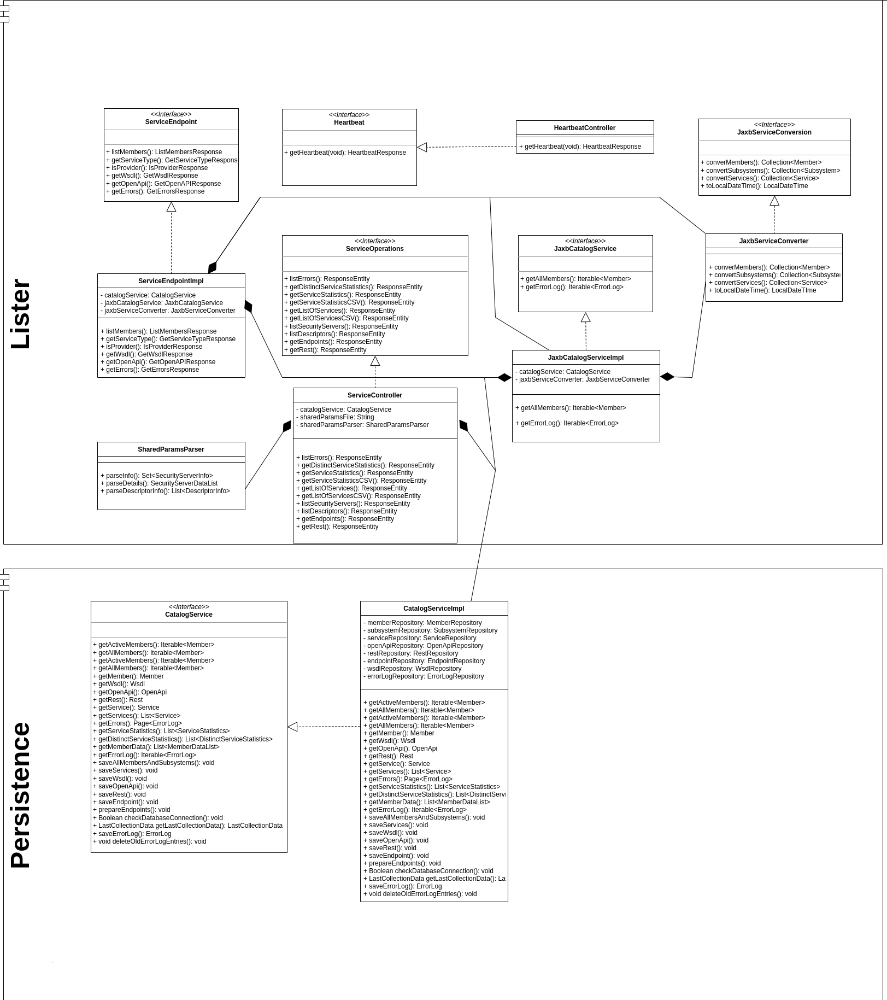

# Introduction to X-Road Catalog Lister

The purpose of this module is to provide a web service which lists all the X-Road members and the services they provide 
together with services descriptions.

A class diagram illustrating X-Road Catalog Lister implementation with the `default` and `FI` profiles:



See also the [Installation Guide](../doc/xroad_catalog_installation_guide.md) and
[User Guide](../doc/xroad_catalog_user_guide.md).

## Configuration

X-Road Catalog Lister can be configured by creating a copy of the [application.yaml](/src/main/resources/application.yaml) file.
The following properties are available:

### Spring Boot Configurations

* [A complete list of Spring Boot's configurations](https://docs.spring.io/spring-boot/appendix/application-properties/index.html)
* For all Spring Data JPA related configurations, search for `jpa` under [Data Properties](https://docs.spring.io/spring-boot/appendix/application-properties/index.html#appendix.application-properties.data) section

### Application Specific Configurations

#### Data Source and Liquibase Configurations

| Data Source and Liquibase Configurations                                                                                                                                             | Required | Defaults                                  | Comment                                                                                                                                                                                                                                | Since |
|--------------------------------------------------------------------------------------------------------------------------------------------------------------------------------------|----------|-------------------------------------------|----------------------------------------------------------------------------------------------------------------------------------------------------------------------------------------------------------------------------------------|-------|
| [spring.datasource.url](https://docs.spring.io/spring-boot/appendix/application-properties/index.html#application-properties.data.spring.datasource.url)                             | Y        |                                           |                                                                                                                                                                                                                                        | 1.0.0 |
| [spring.datasource.username](https://docs.spring.io/spring-boot/appendix/application-properties/index.html#application-properties.data.spring.datasource.username)                   | Y        |                                           | If database users will be created by collector's module liquibase scripts (see `spring.liquibase.contexts`), username must match `spring.liquibase.parameters.users.lister.username`.                                                  | 1.0.0 |
| [spring.datasource.password](https://docs.spring.io/spring-boot/appendix/application-properties/index.html#application-properties.data.spring.elasticsearch.password)                | Y        |                                           | If database users will be created by liquibase scripts (see `spring.liquibase.contexts`), username must match `spring.liquibase.parameters.users.lister.password`.                                                                     | 1.0.0 |
| [spring.datasource.driver-class-name](https://docs.spring.io/spring-boot/appendix/application-properties/index.html#application-properties.data.spring.datasource.driver-class-name) | Y        | `org.postgresql.Driver`                   |                                                                                                                                                                                                                                        | 1.0.0 |
| [spring.jpa.database](https://docs.spring.io/spring-boot/appendix/application-properties/index.html#application-properties.data.spring.jpa.database)                                 | N        | `POSTGRESQL`                              | Auto detected by default.                                                                                                                                                                                                              | 1.0.0 |
| [spring.jpa.generate-ddl](https://docs.spring.io/spring-boot/appendix/application-properties/index.html#application-properties.data.spring.jpa.generate-ddl)                         | Y        | `false`                                   | Always use `false`. Lister application is not supposed to change database structure                                                                                                                                                    | 1.0.0 |
| [spring.jpa.open-in-view](https://docs.spring.io/spring-boot/appendix/application-properties/index.html#application-properties.data.spring.jpa.open-in-view)                         | N        | `false`                                   | Preferably `false` in production.                                                                                                                                                                                                      | 1.0.0 |
| [spring.jpa.show-sql](https://docs.spring.io/spring-boot/appendix/application-properties/index.html#application-properties.data.spring.jpa.show-sql)                                 | N        | `false`                                   | Use to debug SQL statements executed. Preferably `false` in production.                                                                                                                                                                | 1.0.0 |
| [spring.jpa.hibernate.ddl-auto](https://docs.spring.io/spring-boot/appendix/application-properties/index.html#application-properties.data.spring.jpa.hibernate.ddl-auto)             | Y        | `none`                                    | Keep to `none` to prevent hiberante from trying to update the database.                                                                                                                                                                | 1.0.0 |
| spring.jpa.properties.hibernate.dialect                                                                                                                                              | Y        | `org.hibernate.dialect.PostgreSQLDialect` | PostgreSQL is the supported RDMBS. But change to other dialect according to the used RDBMS, if needed. Available options can be found [here](https://docs.jboss.org/hibernate/stable/orm/javadocs/org/hibernate/dialect/Dialect.html). | 1.0.0 |

#### OpenAPI documentation configurations

| Spring Boot framework configurations | Required | Defaults                      | Comment                                                          | Since |
|--------------------------------------|----------|-------------------------------|------------------------------------------------------------------|-------|
| springdoc.packagesToScan             | Y        | `org.niis.xroad,fi.dvv.xroad` | List of packages to include in the documentation. Do not modify. | 1.0.0 |
| springdoc.api-docs.enabled           | Y        | `true`                        | Enables OpenApi endpoint                                         | 1.0.0 |
| springdoc.swagger-ui.enabled         | Y        | `true`                        | Enables Swagger-UI                                               | 1.0.0 |
| springdoc.swagger-ui.path            | Y        | `/api-docs`                   | Swagger-UI path to be used                                       | 1.0.0 |

#### Parameters used by X-Road Lister module

| Parameter                          | Required | Defaults | Description                                                                                                           | Since |
|------------------------------------|----------|----------|-----------------------------------------------------------------------------------------------------------------------|-------|
| `xroad-catalog.shared-params-file` | Y        |          | A parameter for setting the path to shared params file exported from X-Road server.                                   | 1.0.0 |
| `xroad-catalog.country.fi.enabled` | Y        | `false`  | A parameter to enable/disable Finland specific features. If `false`, then all Finland specific endpoints are disabled | 1.0.0 |

## Build

X-Road Catalog Lister can be built by running:

```bash
../gradlew clean build
```

## Run

X-Road Catalog Lister can be run using Gradle:

```bash
../gradlew bootRun
```

or running it from a JAR file:

```bash
java -jar build/libs/xroad-catalog-lister.jar
```
