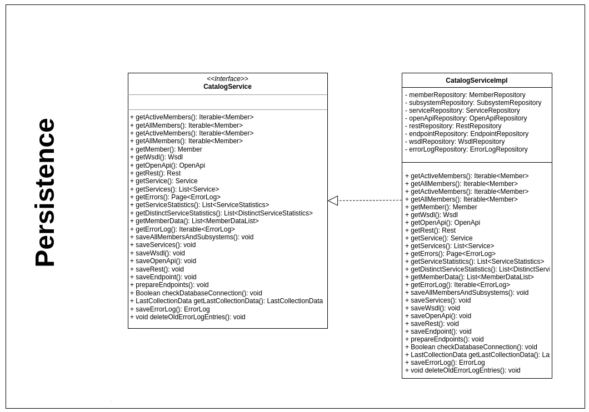

# Introduction to X-Road Catalog Persistence

The purpose of this module is to persist and read persisted data. The module is used by the Collector and Lister modules.

A class diagram illustrating X-Road Catalog Persistence:



See also the [Installation Guide](../doc/xroad_catalog_installation_guide.md) and
[User Guide](../doc/xroad_catalog_user_guide.md).

## Build

X-Road persistence can be built with:

```bash
../gradlew clean build
```
